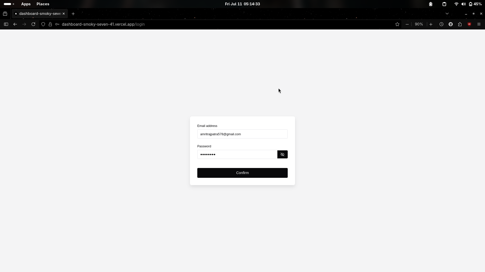
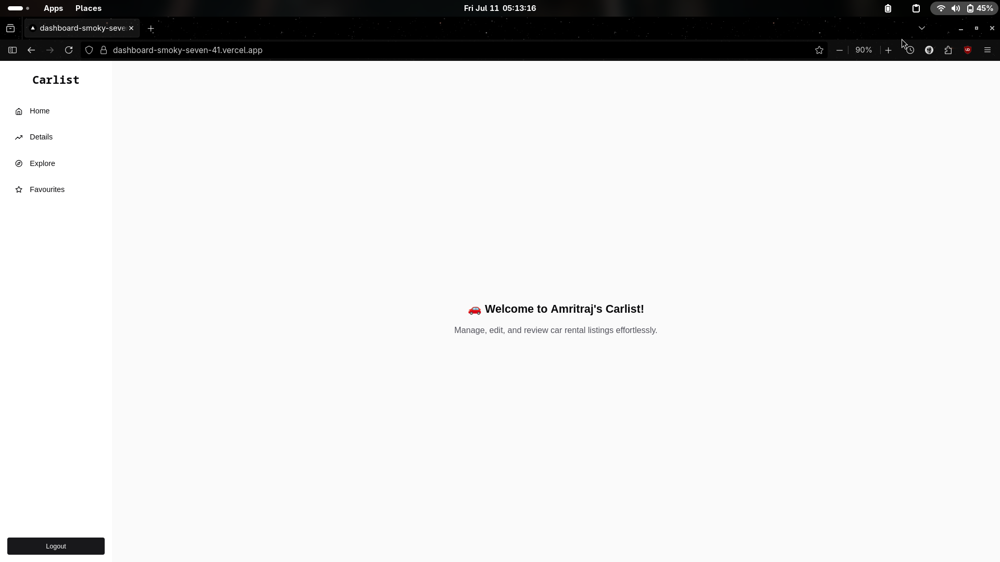
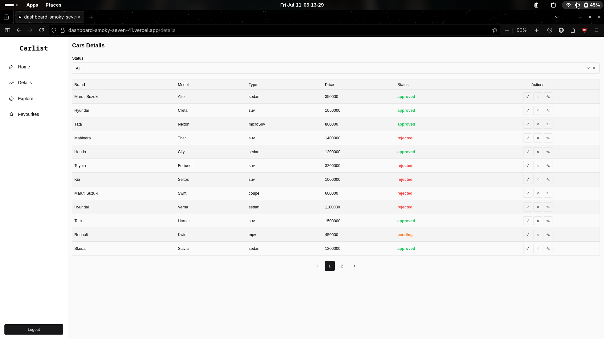
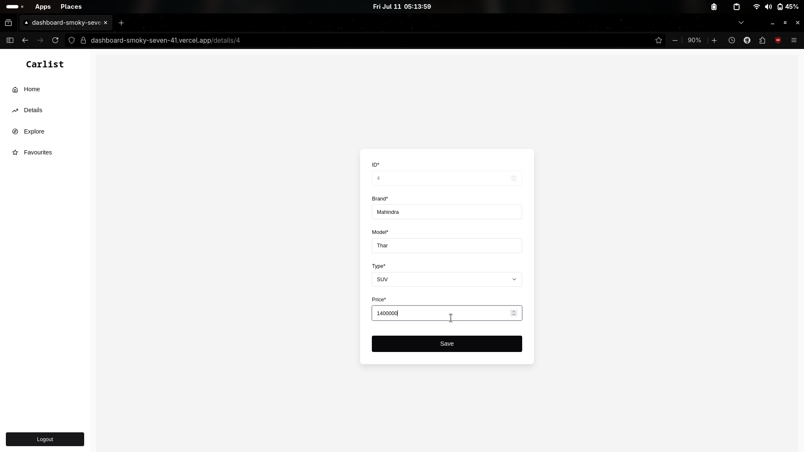

# Car Dashboard

A clean and functional **Dashboard** built with **Next.js**, **Chakra UI**, and **pnpm**, designed to manage car rental listings.

---

## 🌐 Deployment

The app is deployed using **[Vercel](https://vercel.com/)**:

🔗 [Live Demo](https://dashboard-smoky-seven-41.vercel.app/)

---

## ✨ Features

- **Mock Login System** with route protection
- **Server-side rendering** using `getServerSideProps`
- **Chakra UI + Accessible Components**
- **Paginated listing table** with:
  Approve / Reject / Edit buttons and
  Status filtering (`approved`, `pending`, `rejected`)
- **Form pre-filled with listing data**
- **LocalStorage-based persistence** using custom React hooks
- **API Routes** to simulate backend listing actions
- **Deployed on Vercel**

---

## 📦 Tech Stack

- **Framework**: [Next.js 15](https://nextjs.org/)
- **UI Library**: [Chakra UI v3](https://chakra-ui.com/)
- **Package Manager**: [pnpm](https://pnpm.io/)
- **Language**: TypeScript
- **Auth Storage**: LocalStorage
- **API**: Next.js API routes (mock in-memory)
- **State Management**: React hooks + Context pattern

---

## Getting Started

### 1. Clone the Repository

```bash
git clone https://github.com/amritrajpatra578/dashboard.git
cd dashboard
```

### 2. Install Dependencies

```bash
pnpm install
```

### 3. Run Locally

```bash
pnpm dev
```

Visit: [http://localhost:3000](http://localhost:3000)

---

## 🗂️ Project Structure

```
src/
├── pages/              # Next.js pages
│   ├── login.tsx
│   ├── dashboard.tsx
│   └── details/[id].tsx
├── components/         # Shared UI components (Sidebar, Form, Table, etc.)
├── hooks/              # Custom hooks (useAuthStorage, useCarStorage)
├── car.ts              # Types & sample data for cars
├── api/                # Next.js API routes
```

---

## 🧪 Credentials (Mock Login)

To access the dashboard:

- **Email**: `amritrajpatra578@example.com`
- **Password**: `amritraj`

Authentication data is stored using `localStorage`.

---

## 🖼️ Demo & Preview

| Page         | Preview                                   |
| ------------ | ----------------------------------------- |
| Login Page   |          |
| Home         |            |
| Dashboard    |  |
| Edit Listing |            |

## 📹 Demo Video

<video src="./public/demo/screencast.mp4" controls width="100%" style="max-width: 900px; border-radius: 8px;">
  Your browser does not support the video tag.
</video>
---

## 📋 Scripts

| Command      | Description                  |
| ------------ | ---------------------------- |
| `pnpm dev`   | Start development server     |
| `pnpm build` | Build the app for production |
| `pnpm start` | Start production server      |
| `pnpm lint`  | Run ESLint checks            |

---

## 🙋‍♂️ Author

**Amritraj Patra**
🔗 [GitHub](https://github.com/amritrajpatra578)
📧 [Email](mailto:amritrajpatra578@gmail.com)

---
